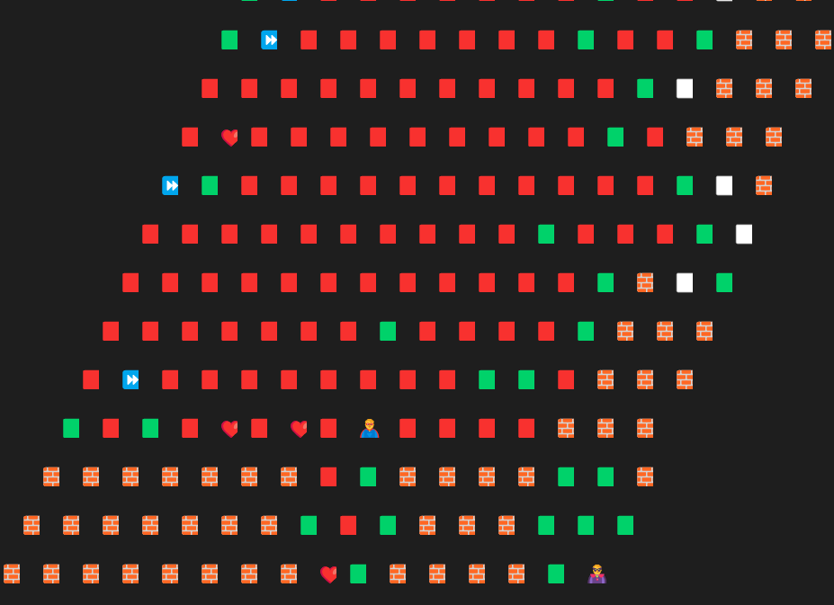

# 2022 种子杯赛题
## 目录结构

```
./
├── README.md
├── config.json
├── seedcupServer  # seedcup server
├── bot            # baseline model
├── documents
│   ├── 2022种子杯初赛试题.pdf
└── client
    ├── base.py    # commen class/enum
    ├── config.py  # read config file
    ├── req.py     # request packet
    ├── resp.py    # response packet
    ├── ui.py      # ui for debug
    └── main.py    # main entry
```


## 使用说明

默认工作目录在最外层目录即为上图所示的``./``
```bash
# launch server
./seedcupServer # if run into permission denied problem, run `chmod +x server` first

# launch python client
python client/main.py

# launch bot
./bot # if run into permission denied problem, run `chmod +x server` first
```

python客户端提供了玩家手玩的功能，两名玩家可以连接同一台机器手玩游戏体验游戏机制。


## 传输协议
客户端和服务端通信需要遵循一定的协议，为了便于选手debug，采用json序列化及反序列化。在python客户端中已经实现了通信的协议，理论上选手可以直接按照客户端提供的接口即可。

### Reqeust协议
#### 总协议
总的协议体如下：`type`字段为`1`表示`InitReq`，`type`字段为`2`表示`ActionReq`。`data`字段则包含具体的请求。
```json
{
  "type": 1,
  "data": {

  }
}
```
#### InitReq
`Init`请求告知服务端主武器和特殊武器的类型。

```json
{
    "masterWeaponType": 1,
    "slaveWeaponType": 2
}
```
#### ActionReq
`Action`请求告知服务端客户端要进行的具体行动。

```json
{
    "characterID": 1,
    "actionType": 2,
    "actionParam": {}
}
```

### Response协议
总的协议体如下：`type`字段表示`resp`类型，`data`字段表示对应的具体的值。
```json
{
  "type": 1,
  "data": {

  }
}
```
#### ActionResp
`ActionResp`会返回击杀数`kill`，当前得分`score`，以及整个地图信息，选手可以利用这些信息训练模型。

```json
{
    "playerID": 0,
    "frame": 1,
    "color": 1,
    "kill": 1,
    "score": 20,
    "characters": [],
    "map":{
        "blocks": [
            {
                "x": 0,
                "y": 0, 
                "frame" : 1,
                "valid": true,
                "color": 2,
                "objs": [

                ]
            }
        ]
    }
}
```
##### Obj
每个`block`可能含有0个或多个`obj`, `obj`有三种类型:`Character`，`Item`，`SlaveWeapon`。
`Character`为玩家操控的角色，有以下属性

```json
{
    "x": 0,
    "y": 0,
    "playerID": 0,
    "characterID": 0,
    "direction": 1,
    "color": 2,
    "hp": 2,
    "moveCD": 2,
    "moveCDLeft": 2,
    "isAlive": true,
    "isSneaky": true,
    "isGod": false,
    "rebornTimeLeft": 0,
    "godTimeLeft": 0,
    "slaveWeapon":{},
    "masterWeapon": {}
}
```
`Item`为场上的增益`buff`，有以下属性

```json
{
    "buffType": 0
}
```
`SlaveWeapon`为特殊武器，有以下属性

```json
{
    "weaponType": 1,
    "playerID": 1
}
```
#### GameOverResp
当游戏结束时会发送`GameOverResp`，有以下属性
```json
{
    "scores": [20,22],
    "result": 1
}
```


# 分析

时间性能有要求，内存够用，不妨以空间换时间，能存的都可以存下来。

抓取并保存了服务器发送的数据，见文件夹中的 resp.json, end.json, last.json

每一个回合都会收到服务器发送的 resp，加上 init 和 end，一共有602个。

block中的color属性可以用来判断一块的归属者，0表示未被占领，valid判断是否是墙。

包含buff的map中的block，bufftype为1表示为加速，为2表示加生命

```json
{
    "color": 0,
    "frame": 146,
    "objs": [{ "status": { "buffType": 1 }, "type": 2 }],
    "valid": true,
    "x": 4,
    "y": -7
}
```

objs 中的 type 含义：

```json
Character = 1
Item = 2
SlaveWeapon = 3
```


作为网络输入的属性：

- 自身的信息：血量，cd，武器
- 对手的信息：血量，cd
- 向墙体移动，隐⾝时向未占领的格点移动将会扣除CD
- 可以引爆对方的特殊武器
- 隐身状态受到攻击不计伤害


# 问题

如果 回合数 较多，会在后期进入障碍区出不来，导致输掉队局



通过计算目标单周围的障碍数目可以缓解，但是还不知道是否彻底解决。


# 记录

**第一次提交**：计算destination没有考虑周围的障碍数目`Onum`，得分189
